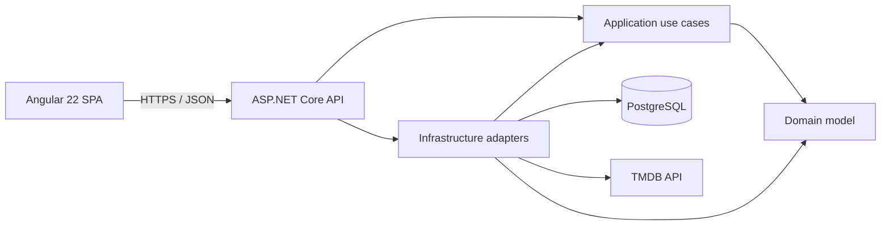

# MyMovie

[](https://github.com/Vinicius-Gamote/MyMovie/actions/workflows/ci.yml)

> A production-minded movie discovery platform built to demonstrate full-stack engineering with .NET, Angular, PostgreSQL, Domain-Driven Design, automated testing, and Docker.

MyMovie helps visitors discover their next movie and gives registered members a private space to build a watchlist and publish reviews. Movie metadata comes from TMDB through a protected backend integration; provider credentials are never exposed to the browser.

The entire product, source code, interface, and documentation are written in English.

## At a glance

MyMovie demonstrates the ability to design and deliver a complete web product rather than an isolated code sample:

- A responsive Angular application with accessible navigation and Angular Material components.
- A versioned ASP.NET Core HTTP API organized as a DDD modular monolith.
- PostgreSQL persistence with EF Core mappings, constraints, and committed migrations.
- Secure cookie authentication, anti-forgery protection, role-based authorization, and rate limiting.
- A server-side TMDB adapter with resilience policies, caching, request coalescing, and stale-data fallback.
- Unit, integration, component, and Playwright browser tests.
- Reproducible development and deployment through Docker Compose and multi-stage container images.
- Specification-Driven Development artifacts covering requirements, architecture, execution, and traceability.

## Product capabilities

### Movie discovery

- Browse current movies ordered by release date.
- Load additional pages progressively without duplicate results.
- Search by title through a debounced, cancellable search experience.
- Preserve browsing context and scroll position when returning from movie details.
- Inspect synopsis, release date, runtime, genres, provider rating, vote count, artwork, and cast.
- Recover gracefully from missing content or temporary provider failures.

### Member experience

- Create an account and sign in through secure cookie-based sessions.
- Maintain a private, de-duplicated watchlist.
- Add and remove movies from the details and watchlist experiences.
- Publish one review per movie with a rating from 1 to 10.
- Edit or soft-delete owned reviews with optimistic concurrency protection.

### Administration

- Access a role-protected review moderation area.
- Hide or restore reviews with a required moderation reason.
- Preserve moderation actions as an audit trail.

## Architecture

The backend is a modular monolith with dependencies pointing inward. Domain rules do not depend on ASP.NET Core, EF Core, PostgreSQL, or TMDB.



### Layer responsibilities

| Layer                    | Responsibility                                                                                                                 |
| ------------------------ | ------------------------------------------------------------------------------------------------------------------------------ |
| `MyMovie.Domain`         | Aggregates, value objects, invariants, review lifecycle, watchlist rules, and provider-independent movie references.           |
| `MyMovie.Application`    | Use cases, ports, normalized contracts, validation, authorization decisions, and orchestration.                                |
| `MyMovie.Infrastructure` | EF Core persistence, ASP.NET Core Identity, PostgreSQL, TMDB integration, caching, and resilience.                             |
| `MyMovie.Api`            | Versioned controllers, authentication, authorization, Problem Details, rate limits, health checks, and dependency composition. |
| `frontend`               | Standalone Angular features, Material UI, typed API access, route guards, responsive layouts, and browser state.               |

The browser communicates only with the MyMovie API. PostgreSQL owns identity data, watchlists, reviews, moderation history, and normalized movie-detail snapshots. TMDB remains an external catalog provider behind the `IMovieProvider` application port.

## Technology stack

| Area                  | Technology                                                                                    |
| --------------------- | --------------------------------------------------------------------------------------------- |
| Backend               | .NET 10, ASP.NET Core controllers, C#                                                         |
| Architecture          | Domain-Driven Design, modular monolith, dependency inversion                                  |
| Persistence           | PostgreSQL 18, Entity Framework Core 10, Npgsql                                               |
| Identity and security | ASP.NET Core Identity, secure cookies, CSRF protection, authorization policies, rate limiting |
| External integration  | TMDB API, typed `HttpClient`, standard resilience handler                                     |
| Frontend              | Angular 22, TypeScript 6, RxJS, standalone components                                         |
| UI                    | Angular Material, Angular CDK, SCSS, responsive CSS Grid                                      |
| Testing               | xUnit, ASP.NET Core integration tests, Vitest, Playwright                                     |
| Delivery              | Docker, Docker Compose, Nginx, GitHub Actions                                                 |

## Engineering highlights

- Errors follow RFC 9457 Problem Details and include stable application codes and correlation IDs.
- Catalog calls use timeouts, bounded retries, circuit breaking, cancellation, and server-side authentication.
- Movie detail snapshots support configurable fresh and stale windows for graceful provider degradation.
- Watchlist operations are idempotent and database uniqueness constraints reinforce domain invariants.
- Reviews use value objects, ownership checks, one-active-review constraints, soft deletion, and concurrency versions.
- User-generated review content is stored and rendered as plain text.
- The responsive interface is verified at mobile and desktop breakpoints with automated overflow, image-ratio, and form-layout checks.
- Production container stages run as non-root users with read-only filesystems, health checks, and explicit shutdown signals.

## Repository structure

```text
MyMovie/
├── backend/
│   ├── src/
│   │   ├── MyMovie.Api/
│   │   ├── MyMovie.Application/
│   │   ├── MyMovie.Domain/
│   │   └── MyMovie.Infrastructure/
│   └── tests/
│       ├── MyMovie.Api.IntegrationTests/
│       ├── MyMovie.Application.Tests/
│       ├── MyMovie.Domain.Tests/
│       └── MyMovie.Infrastructure.IntegrationTests/
├── frontend/
│   ├── e2e/
│   └── src/app/
├── deploy/
│   ├── compose/
│   └── docker/
├── specs/
│   ├── requirements.md
│   ├── Design.md
│   ├── Tasks.md
│   └── codex.md
└── .github/workflows/ci.yml
```

## Quick start with Docker

### Prerequisites

- Docker Engine with Docker Compose v2 or Docker Desktop.
- A TMDB API read access token from the [TMDB developer portal](https://developer.themoviedb.org/docs/getting-started).

### 1. Configure local secrets

Copy `.env.example` to `.env`, then replace the placeholder values:

```dotenv
TMDB_ACCESS_TOKEN=your-read-access-token
POSTGRES_PASSWORD=local-development-only
POSTGRES_PORT=5433
```

The `.env` file is ignored by source control. Never commit a real TMDB token.

### 2. Start the complete application

```shell
docker compose --env-file .env -f deploy/compose/compose.yaml --profile full up --build -d
```

### 3. Open the services

| Service         | URL                                                                      |
| --------------- | ------------------------------------------------------------------------ |
| Web application | [http://localhost:4200](http://localhost:4200)                           |
| API             | [http://localhost:5080](http://localhost:5080)                           |
| API readiness   | [http://localhost:5080/health/ready](http://localhost:5080/health/ready) |
| API liveness    | [http://localhost:5080/health/live](http://localhost:5080/health/live)   |

### 4. Stop the application

```shell
docker compose --env-file .env -f deploy/compose/compose.yaml --profile full down
```

This command preserves the named PostgreSQL development volume. Add `--volumes` only when you intentionally want to remove local database data.

## Local development with hot reload

### Prerequisites

- .NET SDK 10.0.303 or a compatible .NET 10 feature band.
- Node.js 24 and npm 11.
- Docker for the local PostgreSQL dependency.

Start only PostgreSQL:

```shell
docker compose --env-file .env -f deploy/compose/compose.yaml up -d database
```

Configure the backend token with .NET user secrets:

```shell
dotnet user-secrets init --project backend/src/MyMovie.Api/MyMovie.Api.csproj
dotnet user-secrets set "Tmdb:AccessToken" "your-read-access-token" --project backend/src/MyMovie.Api/MyMovie.Api.csproj
```

Run the API:

```shell
dotnet run --project backend/src/MyMovie.Api/MyMovie.Api.csproj --urls http://localhost:5080
```

Run Angular in a second terminal:

```shell
cd frontend
npm ci
npm start
```

The Angular development proxy forwards `/api` and `/health` requests to the backend, keeping browser calls same-origin during development.

## API overview

The versioned API is rooted at `/api/v1`.

| Method   | Route                                | Access        | Purpose                                       |
| -------- | ------------------------------------ | ------------- | --------------------------------------------- |
| `GET`    | `/api/v1/movies/latest`              | Public        | Retrieve the release-date-ordered movie feed. |
| `GET`    | `/api/v1/movies/search`              | Public        | Search movies by title.                       |
| `GET`    | `/api/v1/movies/{movieId}`           | Public        | Retrieve movie details and cast.              |
| `POST`   | `/api/v1/auth/register`              | Public        | Create a member account.                      |
| `POST`   | `/api/v1/auth/sign-in`               | Public        | Start an authenticated session.               |
| `POST`   | `/api/v1/auth/sign-out`              | Member        | End the current session.                      |
| `GET`    | `/api/v1/watchlist`                  | Member        | Retrieve the current member's watchlist.      |
| `PUT`    | `/api/v1/watchlist/movies/{movieId}` | Member        | Add a movie idempotently.                     |
| `DELETE` | `/api/v1/watchlist/movies/{movieId}` | Member        | Remove a movie idempotently.                  |
| `GET`    | `/api/v1/movies/{movieId}/reviews`   | Public        | Retrieve published reviews.                   |
| `POST`   | `/api/v1/movies/{movieId}/reviews`   | Member        | Publish a review.                             |
| `PUT`    | `/api/v1/reviews/{reviewId}`         | Owner         | Edit an owned review.                         |
| `DELETE` | `/api/v1/reviews/{reviewId}`         | Owner         | Soft-delete an owned review.                  |
| `GET`    | `/api/v1/admin/reviews`              | Administrator | Retrieve the moderation queue.                |

In the Development environment, the OpenAPI document is available at `/openapi/v1.json`. State-changing cookie-authenticated requests require the `X-XSRF-TOKEN` header issued through `GET /api/v1/auth/csrf`.

## Database migrations

Restore the repository-pinned EF Core tool:

```shell
dotnet tool restore
```

Create a migration after a reviewed persistence-model change:

```shell
dotnet tool run dotnet-ef migrations add DescriptiveName --project backend/src/MyMovie.Infrastructure/MyMovie.Infrastructure.csproj --startup-project backend/src/MyMovie.Api/MyMovie.Api.csproj --output-dir Persistence/Migrations
```

Local development and the full Compose profile apply committed migrations at startup. A production environment should execute migrations once as a dedicated release job before application replicas are deployed.

## Testing and quality checks

### Backend

```shell
dotnet restore backend/MyMovie.slnx
dotnet build backend/MyMovie.slnx --configuration Release --no-restore
dotnet test backend/MyMovie.slnx --configuration Release --no-build
dotnet list backend/MyMovie.slnx package --vulnerable --include-transitive
```

### Frontend

```shell
cd frontend
npm ci
npm test
npx playwright install chromium
npm run e2e
npm run build
npm run format:check
npm audit --audit-level=high
```

The Playwright suite uses controlled API responses rather than the live TMDB service. It covers the latest-feed-to-details journey, debounced search, provider-error recovery, responsive poster proportions, horizontal overflow, and form-icon alignment.

### Containers

```shell
docker compose --env-file .env -f deploy/compose/compose.yaml --profile full config
docker build -f deploy/docker/api.Dockerfile -t mymovie-api:local .
docker build -f deploy/docker/web.Dockerfile -t mymovie-web:local .
```

GitHub Actions restores dependencies, audits packages, builds both applications, runs automated tests, validates Compose, builds production images, and smoke-tests a disposable full stack.

## Security model

- TMDB credentials exist only in backend runtime configuration.
- Authentication uses `HttpOnly`, same-site cookies with bounded session lifetime and lockout rules.
- State-changing requests require an anti-forgery token.
- Member, owner, and administrator boundaries are enforced on the server.
- Endpoint-specific rate limits protect catalog, authentication, and mutation operations.
- Review text is treated as plain text and rendered through Angular's standard escaping.
- API errors avoid leaking stack traces or sensitive configuration.
- Runtime containers use non-root users, read-only filesystems, private networking, and health checks.

Production deployments must terminate TLS, inject secrets from a managed secret store, use encrypted PostgreSQL connections, and configure backups and point-in-time recovery.

## Specification-Driven Development

The project was designed from an explicit specification set:

- [`requirements.md`](specs/requirements.md) defines product behavior, user stories, business rules, and quality requirements.
- [`Design.md`](specs/Design.md) defines the architecture, technology choices, data model, security model, and deployment design.
- [`Tasks.md`](specs/Tasks.md) tracks incremental implementation and release-readiness work.
- [`codex.md`](specs/codex.md) consolidates implementation and execution knowledge.

These documents make architectural intent, completed work, and remaining production activities reviewable instead of leaving them implicit in the codebase.

## Current project status

The complete product stack is implemented and runnable locally. Catalog, account, watchlist, review, and moderation workflows are present, with automated verification across backend, frontend, browser, and container boundaries.

A valid TMDB token is required for live catalog data. Cloud infrastructure, DNS, managed secrets, production telemetry, backups, legal review, and production release approval remain environment-specific delivery activities rather than repository code.

---

Movie data and images are provided by TMDB. MyMovie is not endorsed or certified by TMDB.
